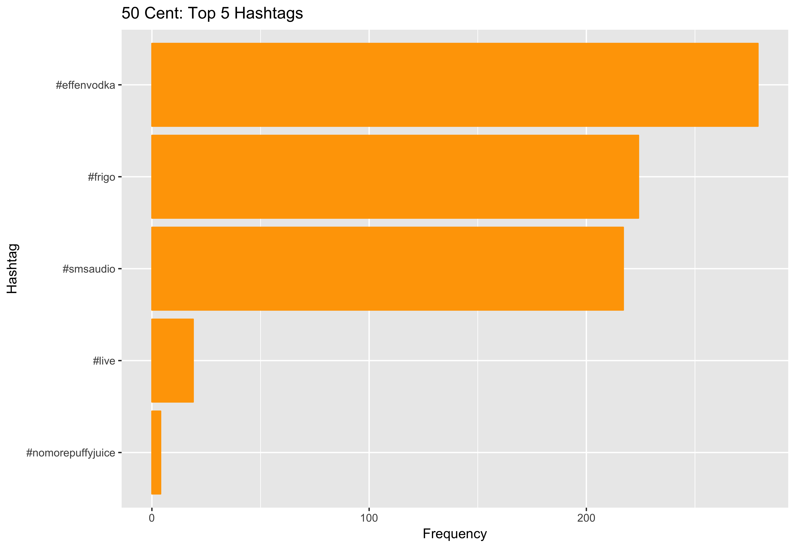
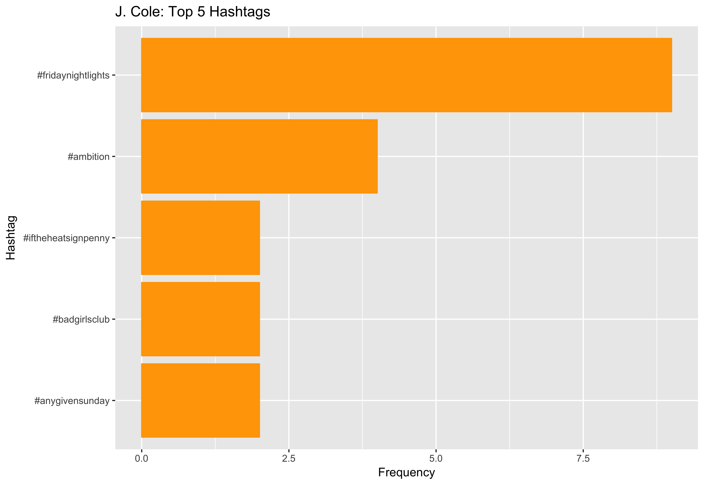
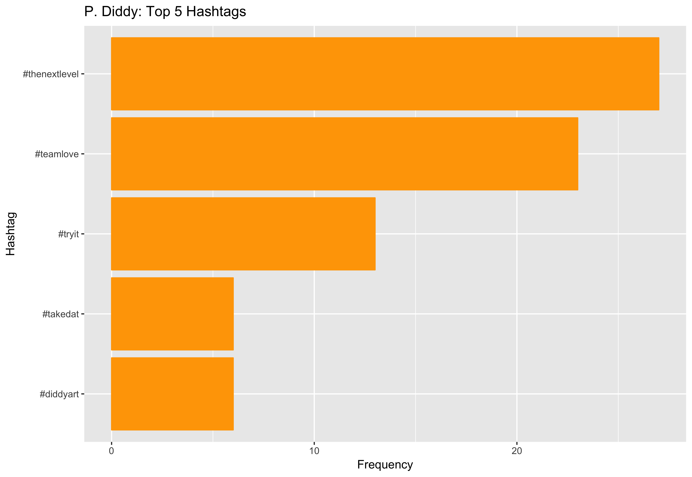

# MA 615 Final Project
## Analysis of Rappers Using Twitter & Million Song Data
### Anahita Bahri

As a super fan of hip-hop and rap, I decided to embark on a study of tweets revolving around these genres, focusing on a few rappers. This project stems from my work with the [Million Song Dataset](https://github.com/anahitabahri/Million-Song-Project), for which the slides can be found [here](https://docs.google.com/presentation/d/13tOvAZHGCCmxWPWQydHQgfHqdQbYAEYmDfxn_jmuroo/edit?usp=sharing). 

I wanted to focus on the rivalry between the late 2Pac and Biggie, but decided to bring in data for rappers who were either heavily influenced by the 2 rappers or considered associated acts. These rappers include 50 Cent, J. Cole, Kendrick Lamar, Nas, P. Diddy, and Snoop Dogg.

Before digging into the text below and in my [markdown file](https://github.com/anahitabahri/Rap-Twitter-Analysis/blob/master/Rap_Analysis.Rmd), check out my live shiny apps on <b>Biggie vs. 2Pac lyrics data</b> [here](https://anahita.shinyapps.io/shiny_lyrics_wc/) and on <b>tweets by rappers influenced by Biggie and/or 2Pac</b> [here](https://anahita.shinyapps.io/shiny_rap_tweets_wc/).

## How to navigate this repo

Interested in learning about how I got twitter data? My [get_tweets](https://github.com/anahitabahri/Rap-Twitter-Analysis/blob/master/get_tweets.R) script will guide you through the process of using the twitteR and streamR packages.

How about mapping the us_tweets file in the get_tweets script? Refer to my [mapping_us_tweets](https://github.com/anahitabahri/Rap-Twitter-Analysis/blob/master/mapping_us_tweets.R) script. I used the leaflet package to create a simple map of where the tweets were tweeted from. I wanted to add further functionality to this using shiny, but have stayed unsuccessful for now. The [shiny_map](https://github.com/anahitabahri/Rap-Twitter-Analysis/tree/master/shiny_map) folder will be updated when I've fixed the code. The map of the US looks like the following:

Exploring tweets mentioning biggie vs. 2pac through a shiny app can be found in the [shiny_twitter_wc](https://github.com/anahitabahri/Rap-Twitter-Analysis/tree/master/shiny_twitter_wc) folder. The wordclouds created here didn't tell a very meaningful story. A better next step was to look into how lyrics differed between the 2 rappers, data for which comes from the million song dataset. This shiny app code for lyrics visualization can be found in the [shiny_lyrics_wc](https://github.com/anahitabahri/Rap-Twitter-Analysis/tree/master/shiny_lyrics_wc) folder. 

The [exploring_rapper_data](https://github.com/anahitabahri/Rap-Twitter-Analysis/blob/master/exploring_rapper_data.R) script includes code that extracts the most common hashtags used by those rappers that were either heavily influenced by 2Pac and/or Biggie or were considered associated acts. The charts can be found in the [hashtag_charts](https://github.com/anahitabahri/Rap-Twitter-Analysis/tree/master/hashtag_charts) folder, but are also displayed below. Also, as I mentioned earlier, I created a shiny app that displays word clouds for these rappers too. The code used for creating that shiny app can be found in the [shiny_rap_tweets_wc](https://github.com/anahitabahri/Rap-Twitter-Analysis/tree/master/shiny_rap_tweets_wc) folder.

Lastly, I explored the Million Song Dataset to test out gganimate. The code and gifs can be found in the [msd_analysis](https://github.com/anahitabahri/Rap-Twitter-Analysis/tree/master/msd_analysis) folder. The animated charts can be found below too.

Hope you enjoy exploring this project!

## Milliong Song Dataset
#### Artist familiarity & hotttnesss for rap and country over the years

#### Artist familiarity & hotttnesss for rap vs. country

#### Artist familiarity & hotttnesss for rap over the years

## Top 5 Hashtags for Rappers
As I mentioned, these rappers were either influenced by 2Pac and/or Biggie OR were considered associated acts.

### 50 Cent

### J. Cole

### Kendrick Lamar

### Nas

### P. Diddy

### Snoop Dogg

